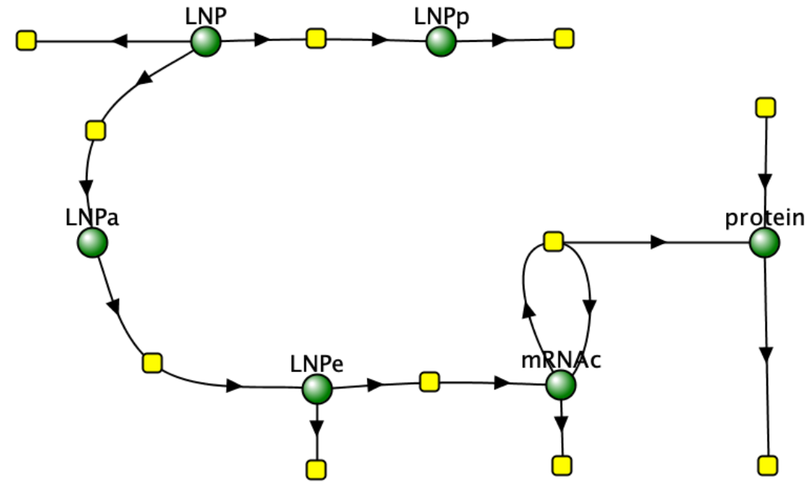
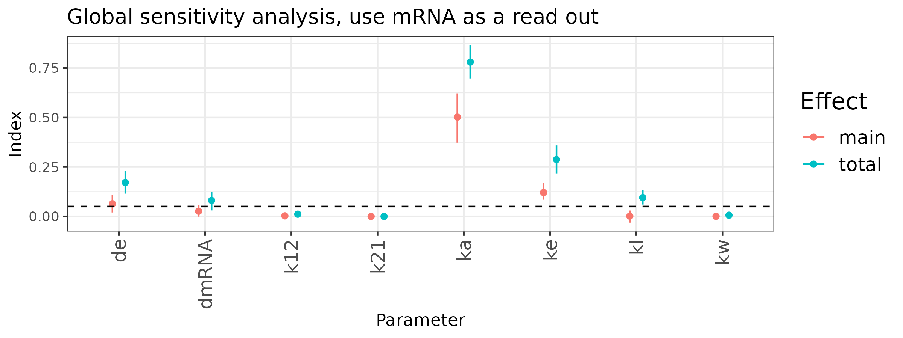
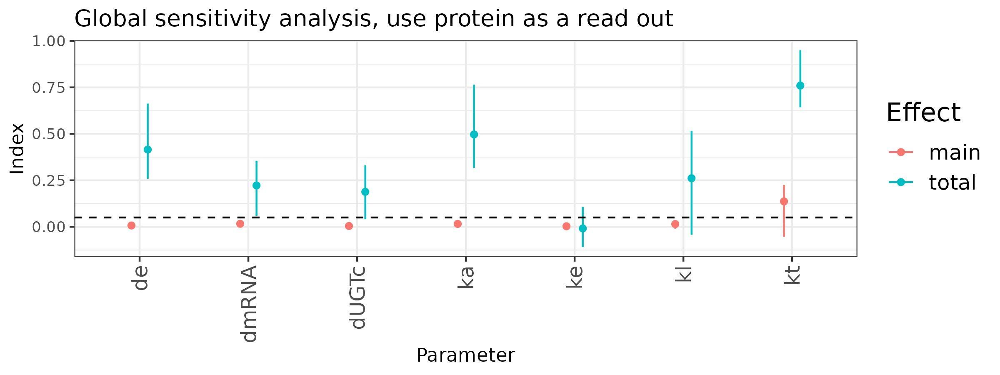
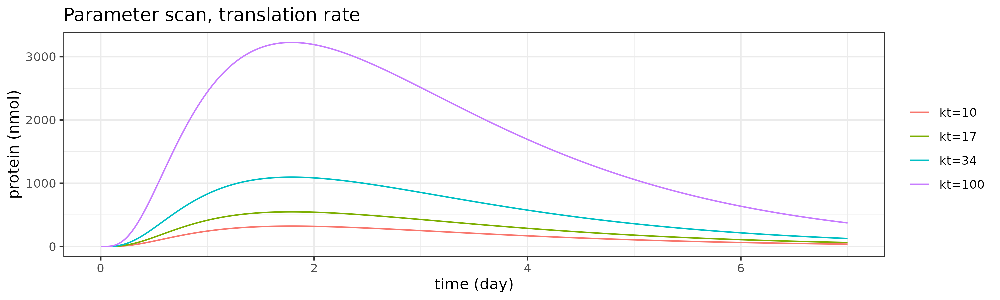
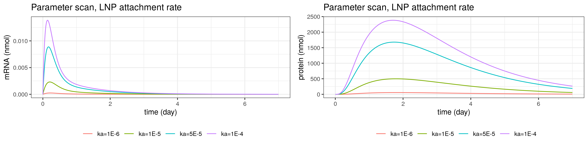
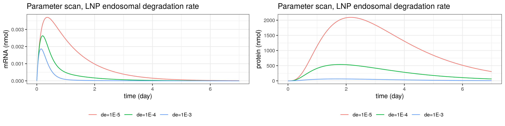

# Model development & analysis

This model is developed in Gunn rats and scaled to human. The scaled QSP model was used for first-in-human dose projections.

## Summary

This repo aims to implement the model published in [Apgar et al., 2018](https://www.ncbi.nlm.nih.gov/pmc/articles/PMC6391595/). The implementation is carried out in mrgsolve in R. Setting up the environment is described in the parent folder. 

We were unable to replicate the full model of bilirubin production in hepatocyte due to the lacking in detailed in the original paper. But our model were able to reproduce mRNA-LNP dyanmics. 

Furthermore, sensitivity analysis is carried out on the the simplified model that focuses on mRNA-LNP and protein synthesis only. We find that the expression of transduced protein is heavily influenced by mRNA translation rate, while tissue mRNA copy number is determined by LNP uptake rate. 


## Implementation of model from [Apgar et al., 2018](https://www.ncbi.nlm.nih.gov/pmc/articles/PMC6391595/)

The implementation is heavily based on the code and parameters that provided in the paper.

Parameters that are not clear from the paper are listed as follows:
- LNP molecular weight
- bilirubin production mechanism and related parameters
- hepatovyte volume
- rat weight and its liver weight

To see more details and how things are addressed, check [here](https://docs.google.com/document/d/19Vtvw3pB8rx4fkuz2b6Fi24_PjGoij63VWwKpnwu4ig/edit?usp=sharing). 

Note in the current version, the implmentation can only capture the dynamics of LNP and mRNA, but not the full model. To see the validational result, check [test1.R](../Apgar2018/test1.R).

## Analysis on LNP-mRNA dynamics

This sensitivity analysis are based on the simplified model. 



Global sensitivity are carried out on the simplified model using either mRNA or protein as readout. 

In the mRNA-focused analysis, the rate constant that governs LNP attachment to cells (ka) has a significant impact. The LNP endocytosis and degredation in endosome rates (ke and de, respectively) have somewhat significant impact on the mRNA level. The rate for mRNA endosome escape (kl) and degredation in cytosol (dmRNA) also influences mRNA exposure. 



Interestingly, the PK of LNP does not appear to have a significant impact on the mRNA exposure. 

(add local sense on ka, de, ke; focus on mRNA and mRNA in cytosol)

In the global sensitivity analysis that focuses on protein, we focuses on parameters that governs mRNA uptake, translation, and protein synthesis. We omit the LNP PK parameters as they have limited impact in the mRNA analysis. 

Amongst all the parameters, the mRNA translation rate (kt) has the most significant impact. (say sth here....) 

In addition, parameters that govern LNP attachment to cells (ka), mRNA endosome escape (kl), mRNA degredation in endosome (de) and in cytosol (dmRNA) all influences the protein exposure. This is also expected, as all these parameters will change mRNA level inside cells. 

Furthermore, protein degredation rate (dUGTc) also impact protein exposure. This is also expected, as this rate governs how long a protein molecule can exist in the cytosol. 




Some local sensitivity analysis further reveals that changes in LNP attachment rate (ka) or protein translation rate (kt) modulates the Cmax of mRNA/ protein, but does not change Tmax. 




In contrast, changes in the protein degradation rate has impact on both Cmax and Tmax of protein, as expected. It is also worth noting that based on this graph, engineering a protein with slower degredation rate in cells may be essential for increasing the time between dosing. 


Changes on LNP endosomal degredation rate (de) significantly changes the Tmax and Cmax of mRNA concentration in the tissue (defined as those that are attached to cells, and in endosome and cytosol), but has a less pronounced impact on the Tmax of protein. 




## Other comments based on literature

- PK parameters of LNP tends to be LNP-specific. For example, LNP size negative impacts Vc->Vp rate (k12) ([Lin and Tam, 2015](https://pubmed.ncbi.nlm.nih.gov/26399560/), [Thi et al., 2021](https://pubmed.ncbi.nlm.nih.gov/33918072/)).

- The rate for LNP attaching to cells (ka) tend to be LNP-specific ([Lin and Tam, 2015](https://pubmed.ncbi.nlm.nih.gov/26399560/), [Thi et al., 2021](https://pubmed.ncbi.nlm.nih.gov/33918072/)). It can be modulated by attaching peptide groups on to the lipid ([Thi et al., 2021](https://pubmed.ncbi.nlm.nih.gov/33918072/), [Delehedde et al., 2021](https://www.ncbi.nlm.nih.gov/pmc/articles/PMC8308975/)).

- LNP endocytosis rate (ke) is probably consistent, as it is a receptor-mediated endocytosis, and this pathway is similar to mAb endocytosis. 

- LNP endosomal escape rate is a key optimization goal for LNP development. It is worth noting that 1. only small amount (<2%) RNA can escape endosome, and 2. the process is not well-understood ([Maugeri et al., 2019](https://www.nature.com/articles/s41467-019-12275-6#:~:text=Despite%20the%20fact%20that%2C%20a,reach%20the%20cytosol6%2C12.), [Paramasivam et al., 2022](https://rupress.org/jcb/article/221/2/e202110137/212896/Endosomal-escape-of-delivered-mRNA-from-endosomal)). This rate is typically optimized by modulating pKa/ polarity of lipids in LNPs ([Delehedde et al., 2021](https://www.ncbi.nlm.nih.gov/pmc/articles/PMC8308975/)). Thus, it might be safe to assume it holds across species. 


- LNP endosomal/ lysosomal degradation rate. I don't see this parameters mentioned in any LNP optimization papers. Perhaps we can assume this is a constant across LNPs/ species.

- mRNA translation/ degradation rates. These 2 rates are mRNA-specific and is for sure being optimized ([Hu et al., 2020](https://www.nature.com/articles/s41392-020-0207-x), [Steinle et al., 2021](https://www.sciencedirect.com/science/article/abs/pii/S0169409X21004002)). 

- Protein degradation rate. This parameter is not mentioned in any LNP-optimization paper. Could be a protein-specific parameter. 

## Uncertainty/ modification of the model

- Number of mRNA carried per LNP. It appears that the model assumes 1 LNP carries 1 mRNA. Alternatively, this stoichiometry may also been taken into the consideration of endosomal escape rate. But some clarity would be good. 

- mRNA self-renewal. New technology can be probably added to the model using existing structure. 

- Co-delivery of other proteins. For example, co-deliver a mRNA to enhance the expression of another mRNA ([Delehedde et al., 2021](https://www.ncbi.nlm.nih.gov/pmc/articles/PMC8308975/)). 

# Content of this folder

- ```model1.cpp``` (an implementation from [Apgar et al., 2018](https://www.ncbi.nlm.nih.gov/pmc/articles/PMC6391595/))
- ```validation.R``` (a test file to run the model on figuring out the steady state, ....)
- ```model2.cpp``` (a simplified model derived from Apgar et al., 2018; the model includes the dyanmics of LNP, mRNA, and protein expression)
- ```sens_analysis.Rmd``` (global and local sensitivity analysis of model2)
- img  (the folder that holds all images for this readme page)
- data (the folder host derived data and source data)
- doc (related publications)
- julia (the model implemented in Julia and its verification)

