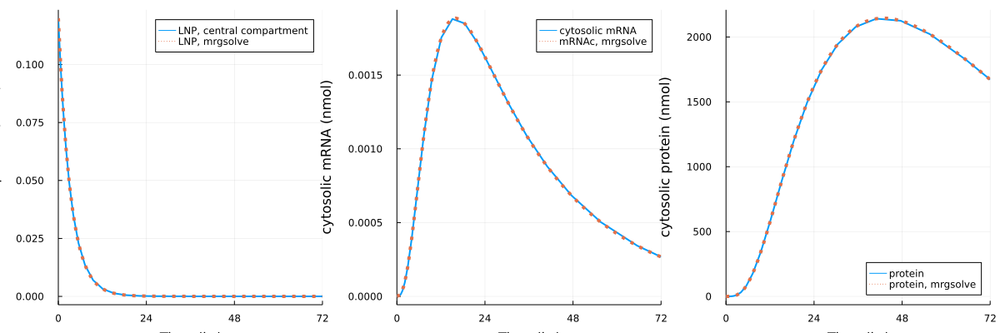

# Summary

This folder contains the model implementation in Julia. The implementation uses ModelingToolkit to make the model readable. The version that is implemented in Julia is the simplified version of the model (`model2.cpp`). 

Verification is provided by comparing simulation results from mrgsolve and from Julia. 

