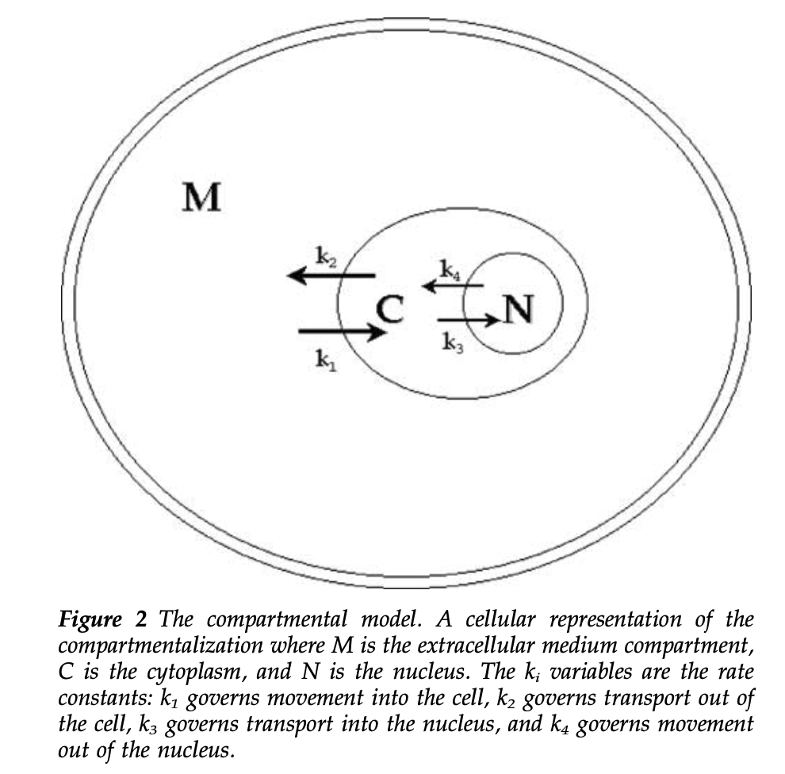
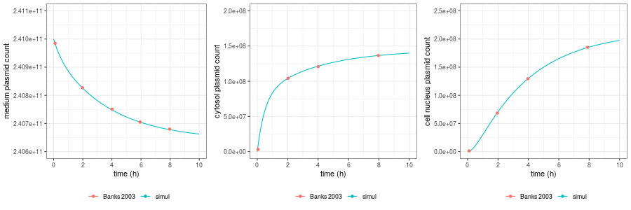
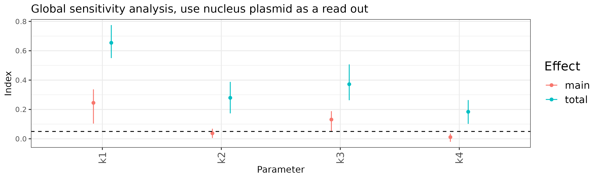

# Summary

(fill this after the repo is finished)

# Model description

This model is published in [Banks et al., 2003](https://www.nature.com/articles/3302076). The model is validated in both HeLa and CV1 cell lines. The experimental data were obtained by transfecting cell line with fluorescence-labelled GFP plasmids. Later cells/ nuclei fluorescence were quantified using fluoremeter or flow cytometry ([James and Giorgio, 2000](https://pubmed.ncbi.nlm.nih.gov/10933952/)). 

The model an in vitro model and is divided into 3 parts: extracellular, cytosol, and nucleus. The plasmid can enter nucleus from cytosol, or can leave nucleus from cytosol. This is, in the original model, interpreted as plasmid can enter nucleus through either active transportation or through passive diffusion. 

# Implementation

The model is implemented in mrgsolve and is verified by comparing simulation result to published figure. 

|  |
| <b> Implementation verification, HeLa cells </b> |
|  |
| <b> Implementation verification, CV1 cells </b> |

# Model analysis

Global sensitivity analysis indicates that the rate that governs plasmid import into cytosol and to nucleus are the most influencial parameters. 

# Content of this folder

- README.md (this readme file)
- img  (the folder that holds all images for this readme page)
- data (the folder host derived data and source data)
- doc (the folder that contains related documents)