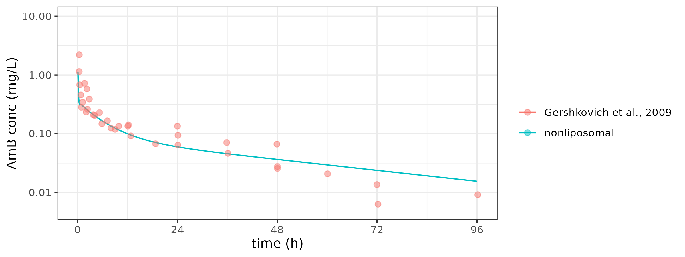

# Model development & analysis

Implementation of model from [Kagan et al., 2013](https://pubmed.ncbi.nlm.nih.gov/23793994/). The paper developed the model in 2 steps: 
1. use compartmental model to determine some shared parameters
2. build a PBPK model for AmbiSome distribution. 

The PBPK model consists of 2 sub-PBPK models: one for the small molecule (Fungizone) that is encapsulated in the liposome, one for liposome. 


## Compartmental model

The implementation of the compartmental model is verified in rats. 


## PBPK model

The implementation is heavily based on the code and parameters that provided in the paper. The implementation is divided into 2 steps: 

1. implementation of the PBPK model for nonliposomal drug (Fungizone)
2. implementation of PBPK model for liposomal drug (AmBisome)

Parameters that are not clear from the paper are listed as follows:

1. Rat cardiac output. The paper provided the method to calculate rat/ mouse cardiac output (based on hematocrit) but failed to provide hematocrit number. The number used in the model is obtained from [Chen et al., 2018](https://www.mdpi.com/1422-0067/19/9/2824/htm). 

2. Fraction of flow leaving the liver. The paper failed to specify whether this number is the hepatic artery flow or venous flow. We assume it is venous flow based on the number. 

3. Fraction of blood volume per body weight. This value is obtained from [Hu et al., 2014](https://www.ncbi.nlm.nih.gov/pmc/articles/PMC4243854/). 

4. Liposomal uptake by heart. This value is assumed to be 0. 

5. Liposomal uptake rate scaling factor. The original paper indicate that these liposomal uptake rate by tissue is scaled by weight to the power of ```b```, where b is not given in [Kagan et al., 2013](https://pubmed.ncbi.nlm.nih.gov/23793994/) for liposomal uptake rates. Here, we assume it to be 0.9.  

6. In addition, the paper seems to suggest that the concentration of drug is lung is divided by a denominator (Klu = 6), without explaining why that might be the case. Our model adjusted this following the paper's suggestion, without understanding the rational behind this action.  

### Validation of PBPK model for nonliposomal drug

The paper does not provide simulation in rats for Fungizone. Thus, we compare the simulation result to observed data. Overall, the simulation is a good fit to the observation. 




### Verification of PBPK model  

We compare the simulation result from our PBPK model to the simulation result published in [Kagan et al., 2013](https://pubmed.ncbi.nlm.nih.gov/23793994/). In this case, we test out both the mouse and rat version of the model. Overall, our simulation replicate the original result well besides simulation result in kidney. 

|  |
|:--:|
| <b> PBPK model verification in rat <b> |

|  |
|:--:|
| <b> PBPK model verification in mouse </b>|

### Validation of PBPK model for liposomal drug

We compare the simulation result to observed data in rats. The fit wasn't the best. 


# Adapting PBPK model for siRNA delivery in mouse

Here we take the model to see whether the we can use the model to capture the LNP-siRNA dynamics in mouse. 

To simplified the model, all the PBPK part related to Fungizone is dropped. Still, we keep the original "release" part of PBPK model to account for potential spontaneous breakdown of LNP. This decision is questionable and need to be thought out later. 

We tested out both version with or without uptake limits in liver and spleen (???). 


The molecular weight and breakdown of the siRNA-LNP is calculated in the following steps:
1. based on the lipid ratio stated in [Christensen et al., 2014](https://pubmed.ncbi.nlm.nih.gov/24389421/), the molecular weight of the LNP is 55220g/mole. 
2. based on [Semple et al., 2010](https://www.nature.com/articles/nbt.1602#Sec15), which is cited by [Christensen et al., 2014](https://pubmed.ncbi.nlm.nih.gov/24389421/), the siRNA weight is 0.05 of LNP weight. That translate into 1 mole of LNP has 2761g of siRNA. 
3. Total siRNA-LNP molecular weight is ~ 5.8E-2mg.nmol-1. 
4. Assume oligonucleotide has molecular weight of ~650.mol-1, and each siRNA has 42-46 oligonucleotide, then each siRNA molecule has molecular weight 27300 - 29900 g.mol-1. This roughly translate to 1 mole of LNP has ~0.1mol siRNA. 

# Content of this folder

## files

+ README.md (this README file)

+ ```Compartmental.cpp``` (The implementation of two-compartmental model in mrgsolve)

+ ```Compartmental.Rmd``` (The main script to validate the compartmental models)

+ ```Fungizone.cpp``` (The implementation of nonliposomal PBPK model in mrgsolve)

+ ```Kagan.cpp``` (The implementation of liposomal PBPK model in mrgsolve)

+ ```PBPK_rat.Rmd``` (The main script to validate the Ambisome PBPK models in rats)

+ ```PBPK_mouse.Rmd``` (The main script to validate the Ambisome PBPK models in mouse)

+ ```LIP_test.Rmd``` (The main script to test adapting Ambisome PBPK model for siRNA-LNP delivery)

+ ```PBPK_LIP0.cpp``` (The model file for directly adopting Ambisome PBPK model for siRNA-LNP delivery)

+ ```PBPK_LIP1.cpp``` (The model file dropped capacity limit in liver and spleen in ```PBPK_LIP0.cpp```)

+ ```PBPK_LIP2.cpp``` (The model focused siRNA uptake in extravascullar space only; all free siRNA are dropped; based on ```PBPK_LIP1.cpp```)

## folder

+ data (data files; see readme.txt in the folder for more information)
+ doc (folder that stores relevant papers and appendices)
+ img (folder that store all the images)