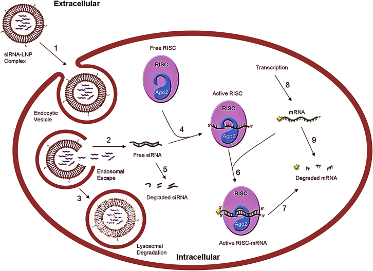
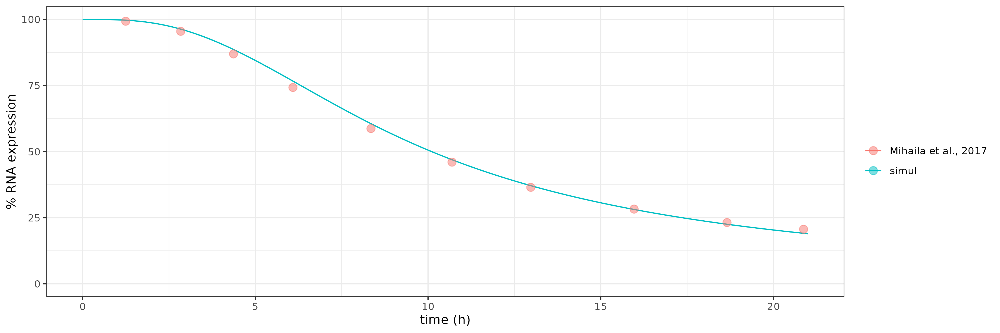

# Summary 

(fill this after the repo is finished)

# Model Desription

The model is published in [Mihaila et al., 2017](https://www.ncbi.nlm.nih.gov/pmc/articles/PMC5415968/). The model describe an in-vitro system for siRNA delivered by LNP and achieve mRNA knockdown. 

Validation data used in this model:

+ Confocal images for siRNA-LNP201 cellular uptake
+ siRNA binding to RISC complex
+ knockdown of the gene-of-interest (SSB gene)

## Implementation

All information is obtained from the original model expect 3 modifications:

1. Units of rate listed in Table 1. All "L" in the kinetics model are dropped. For example, for k7 (i.e. cleavage of target mRNA by RISC), the original paper described it as 7.2L.h-1. We implement as 7.2h-1. We believe this is justified because the rate was reported in [Brown et al., 2005](https://www.nature.com/articles/nsmb931) to be between 1.17E-3s-1 and 2.4E-3s-1. 

2. Initial condition of extracellular siRNA. This value is fitted because the using the value from the paper cannot generate a simulation that makes sense. 

3. The number of RISC molecule and extracellular LNP concentration are constants. These are not specified in the model, but the lack of information on RISC dynamics force the implementation in this way. Assuming extracellular LNP concentration being a constant can be justified by the fact that extracellular growth medium volume (at least, in general cell culture environment) is much larger than intracellular volume. 

# Content of this folder

- README.md (this readme file)
- `mihaila2017.cpp` (direct implementation of the model from [Mihaila et al., 2017](https://www.ncbi.nlm.nih.gov/pmc/articles/PMC5415968/) with no unit conversion)
- `mihaila2017_v1.cpp` (convert mRNA synthesis rate from copies.h-1 to nM.h-1)
- `mihaila2017_v2.cpp` (convert unit from nM-related to copies related; convert all L.h-1 unit to h-1)
- `mihaila2017_v3.cpp` (convert mRNA synthesis rate from copies.h-1 to nM.h-1; assume al L.h-1 units are h-1. This is the version of model used in the final verification step)
- `mihaila2017_v4.cpp` (convert mRNA synthesis rate from copies.h-1 to nM.h-1; convert all L.h-1 unit to h-1)
- `mihaila2017_v5.cpp` (based on v3; the only change is mRNA degradation; see script line 51 for details)
- `verification.Rmd` (Test out all the versions of model implementation)
- img  (the folder that holds all images for this readme page)
- data (the folder host derived data and source data)
- doc (the folder that contains related documents)
