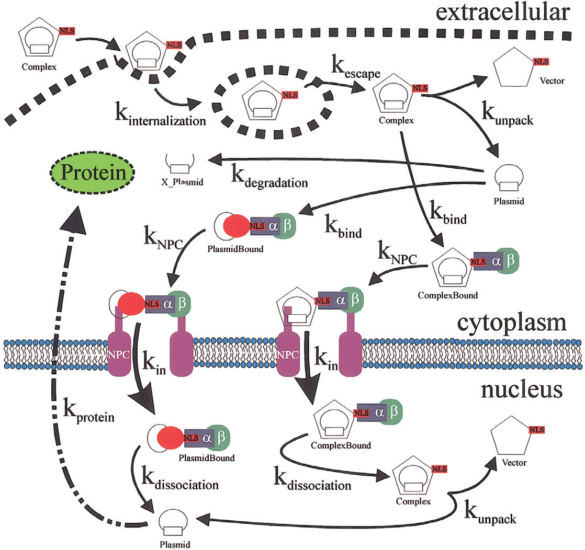
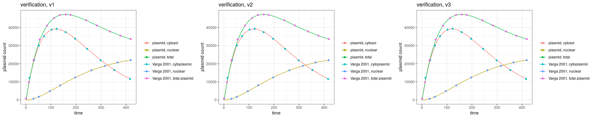
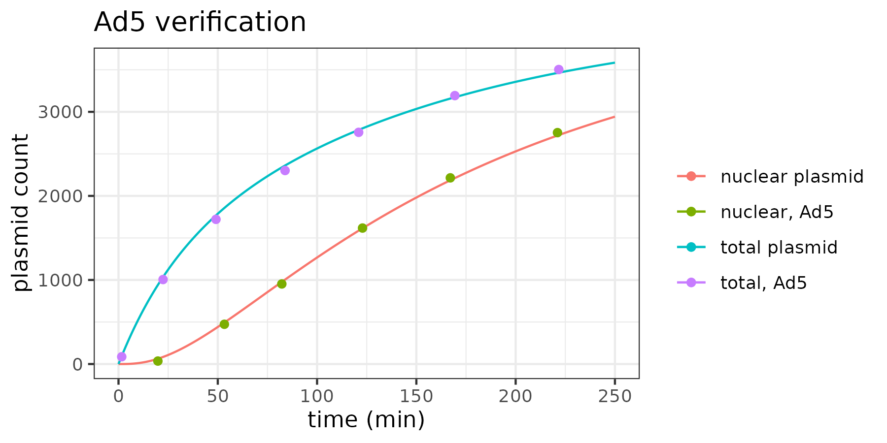

# Goal

This folder aims to implement an existing model for genetic material transfer based on either transfection reagent (e.g. lipofectamine) or AAV. 

# Summary

This model describes the transfection/ transduction of cells with detailed molecular mechanism, with slight difference on the vector uptake difference in the 2001 and 2005 models (see 2001 diagram below). The dynamics of DNA plasmid/ vector can be broken down into roughly 3 steps: vector uptake into the cytosol, transportation into nucleus, and gene expression inside nucleus. In this model, the transcription and translation of DNA plasmid is simplified. 

The model is validated using fluorescence-based assay that measures vector uptake and DNA measured at whole-cell level and inside nucleus. The model per se lacks validation at the protein level (or data not shown, claimed by the authors). 

# Model verification

The base model is published in [Varge et al., 2001](https://pubmed.ncbi.nlm.nih.gov/11708880/). The model was implemented either exactly as what was written in the original paper (v1), or drop the vector dynamics in nuclear (v2), or add on the full dynamics of vector in nuclear (v3). For all of these implementations, they all capture the original dynamics well. 

To implement the model published in [Varga et al., 2005](https://www.nature.com/articles/3302495), we build on v2. We choose this one because there is no obvious reason for us to track the vector (i.e. either empty lipofectamine particle or empty virus capsid). In addition, we also change how degraded plasmid being tracked to a manner that makes more sense. Furthermore, the total plasmid that is being used in the experiment is a tuned. 

# Modification and sensitivity analysis

Some of the obvious problems in the Varga models are that modeling caspid-free DNA molecules/ empty capside entering nucleus, and the uncoating of AAV in cytoplasma, which is in direct contradiction to what is known in the field ([Riyad and Weber, 2021](https://www.nature.com/articles/s41434-021-00243-z)). It also miss the potential of AAV vectors may be held in "reserve" after entering nucleus ([Johnson and Samulski, 2009](https://www.ncbi.nlm.nih.gov/pmc/articles/PMC2648275/)). 

To address the first issue, we dropped all dynamics related to plasmid being imported into the cell nucleus. We also dropped the dynamics of vector uncoating in the cytosol. This model was implemented in [varga2005_m1](varga2005_m1.cpp) file. After these modifications, the rate for plasmid unpacking and transport into nucleus showed much more prominent impact. But the significant impact from plasmid-vector complex disassociating from nuclear pore complex indicated that additional modeling component is necessary for the model to account for the observation that not all viral vector would be in the nuclearplasma ready to be transcribed. 

# Content of the folder

+ README.md (this readme file)
+ `varga_v1.cpp` (the model published in [Varge et al., 2001](https://pubmed.ncbi.nlm.nih.gov/11708880/) with no modification)
+ `varga_v2.cpp` (v1 with vector transport into nucleus being dropped)
+ `varga_v3.cpp` (modification based on v1 with all equations related to vector being transported to nuclear added)
+ `verification_varga2001.Rmd` (the script that verifies the implementation of model published in [Varge et al., 2001](https://pubmed.ncbi.nlm.nih.gov/11708880/))
+ `varga2005.cpp` (implementation of model from [Varga et al., 2005](https://www.nature.com/articles/3302495))
+ `verification_varga2005.Rmd` (the script that verifies the implementation of model published in [Varga et al., 2005](https://www.nature.com/articles/3302495))

folders: 

+ img (store images used in this markdown file)
+ doc (store related papers)
+ data (store datasets used in the simulation)